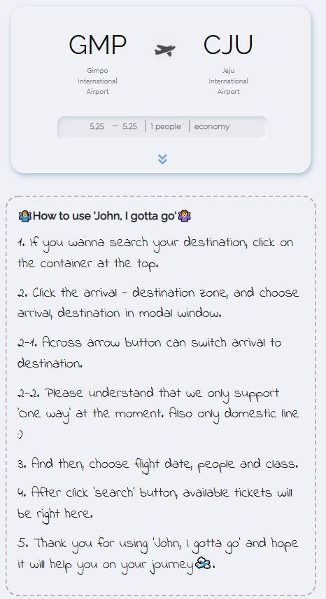
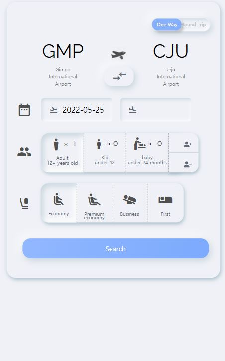

<h1 align="center"> John, I gotta go.. </h1>
<h2> Real-time domestic flight ticket searching (실시간 국내선 항공권 검색)</h2>

[](https://hits.seeyoufarm.com)

[](https://app.netlify.com/sites/johnigottago/deploys)
## Recently update
> (ver 1.0.2) 자체 heroku proxy server 도입으로 cors allow 앱 없이 원활한 검색이 가능합니다. </br> Github-page에서 netlify로 배포 페이지를 변경하였습니다.

# About
> [공공데이터포털](https://www.data.go.kr/index.do "go to api portal")에서 제공받은 국내항공운항정보 API를 활용해 실제 국내선 항공권의 정보를 티켓 (Boarding Pass) 형식으로 형상화하여 User들이 정보를 확인캐 하는 서비스입니다.

</br>

# UI / UX Design
> "_One of the hottest design trends of 2020 is “Neumorphism” (soft UI). We can see a lot of designers with their version of Neumorphic User Interface(UI) on dribbble._"
> > 명암과 반사의 특성들을 적절히 사용한 neumorphism 기법을 적용했습니다. </br>
기존의 Flat Design + Material Design의 그저 평면 위의 떠있는 방식과는 다르게 버튼, 스위치 등의 요소들이 돌출되어 보이게 하여 서비스 이용자들로 하여금 조작하고 싶은 욕구가 생기게 유도할 수 있다는 생각이 디자인 선택에 큰 부분을 차지했습니다.

</br>

# How to use
<h2>🎈서비스 첫 실행 화면</h2>
  <h3> 하단의 처음 사용하는 유저들을 위한 설명이 나타나 있으며, 상단의 간단정보 바를 클릭 시 상세한 정보를 고를 수 있는 바가 생깁니다. </h3></br>

 </br>

 <h2>🎈상세 정보 입력 바</h2>
  <h3> 도착지 칸을 클릭하면, 출발지 - 도착지를 선택할 수 있는 모달창이 생깁니다. 선택 후, 출발 날짜, 인원수, 클래스를 설정한 후 'search' 버튼을 누르면 실제 항공권 정보들을 확인이 가능합니다. </h3></br>
  <p>(💦PS. 현재는 편도 운행만을 제공하고 있습니다. 추후에 v2에서 왕복 항공권도 확인이 가능하게 할 예정입니다.)<p></br>

 </br>

 <h2>🎈결과 확인</h2>
  <h3> 당일 항공권이 존재 한다면, 하단에 티켓들이 나열됩니다. 원하는 항공권을 클릭하시면, 해당 항공권의 실제정보를 확인이 가능합니다. </h3></br>
 

# Languages and Tools


[](https://github.com/buddle6091/buddle6091.github.io)


</br>
</br>

## How to run the service except installed
</br>

 > Click this! 👉 [https://johnigottago.netlify.app/](https://johnigottago.netlify.app/)


</br>

## Project setup
```
npm install
```

### Compiles and hot-reloads for development
```
npm run serve
```

### Compiles and minifies for production
```
npm run build
```

### Lints and fixes files
```
npm run lint
```
</br>

## ⁉ FAQ
1. **김포에서 제주까지 가는 가장 빠른 티켓의 url 링크가 원하지 않는 곳으로 연결되요.** </br>
 A . 원인불명의 버그로 인해 항상 그 구간의 첫번째 티켓의 이미지가 제주항공으로 나옵니다. 다음 패치 때 원인을 찾아 해결에 반영하도록 하겠습니다.

2. **Internet Edge, 스마트폰에서 서치가 안되요.** </br>
 A . ~~CORS(Access-Control-Allow-Origin) 허용프로그램이 Chrome 에서만 구동 가능하여, 현재는 pc Chrome 브라우져에서만 이용가능합니다 :(~~ </br>
 ver 1.0.2 cors 문제는 해결되었습니다!
   </br>
   </br>

# Developer Info

👨‍🎓 [이상원 (https://github.com/buddle6091)](https://github.com/buddle6091) </br>


[](https://github.com/anuraghazra/github-readme-stats)
</br>
</br>


# How to contact me
💌 mail : sw980306@gmail.com </br>

<a href="https://www.instagram.com/buddle_98/">
    
</a>
instagram : buddle_98 </br>
notion : https://buddle6091.notion.site/Junior-Front-end-Developer-9dc99e910f114483a36b7ee04682440f

### Customize configuration
See [Configuration Reference](https://cli.vuejs.org/config/).

## version
~~ver 1.0.0 (05.28) https://buddle6091.github.io/~~ </br>
~~ver 1.0.2 (06.05) : 자체 heroku proxy server 도입으로 cors allow 앱 없이 원활한 검색이 가능합니다. </br> Github-page에서 netlify로 배포 페이지를 변경하였습니다.</br>
ver 1.1.0 (08.03) - 스켈레톤 UI, 반응형 UI 적용. (도중 높이 설정에 따른 이미지 잘림이 보여 수정 예정입니다.)
ver 1.1.1 - 타입스크립트 마이그레이션
